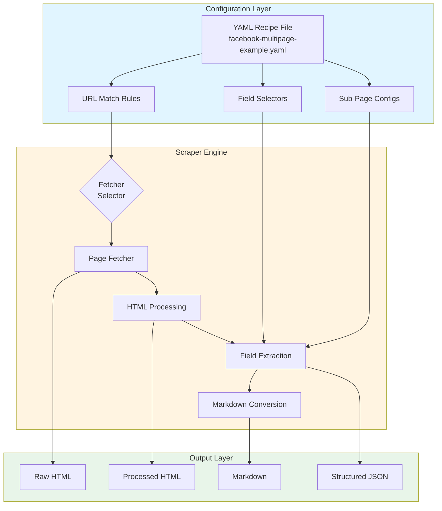
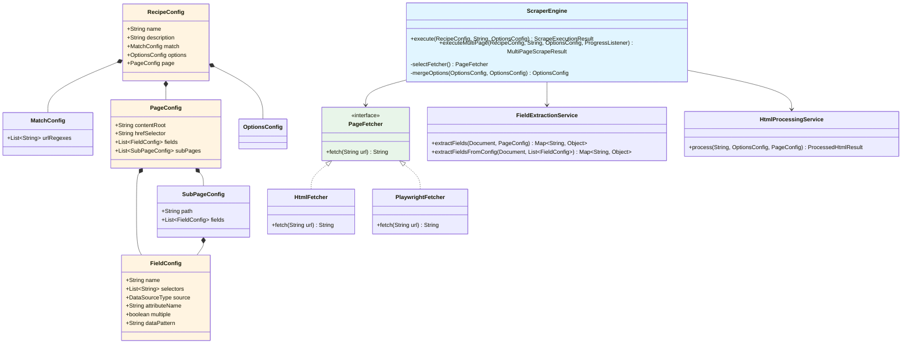
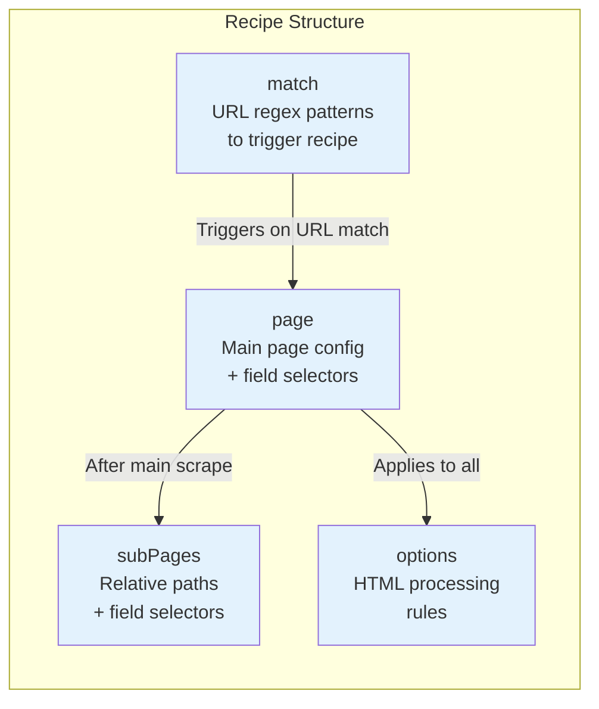
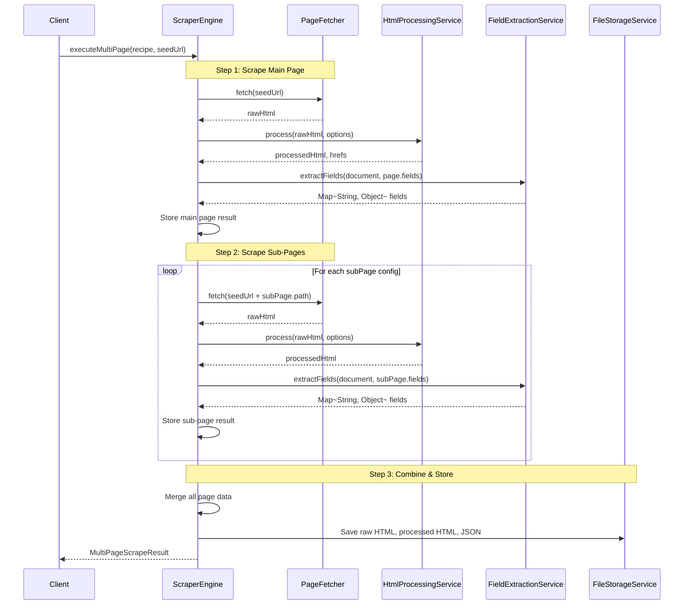
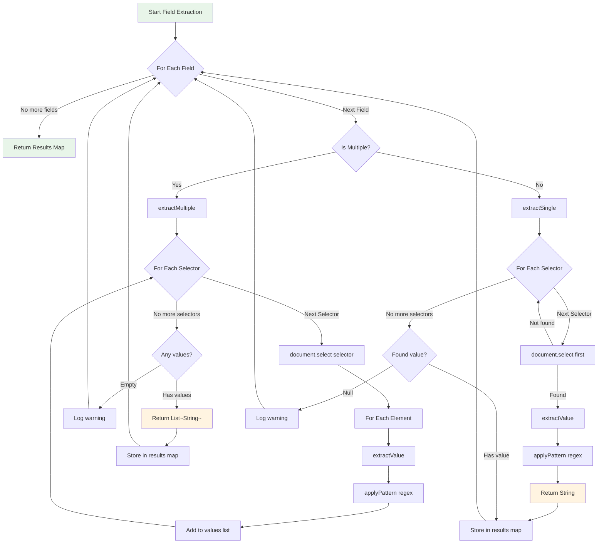
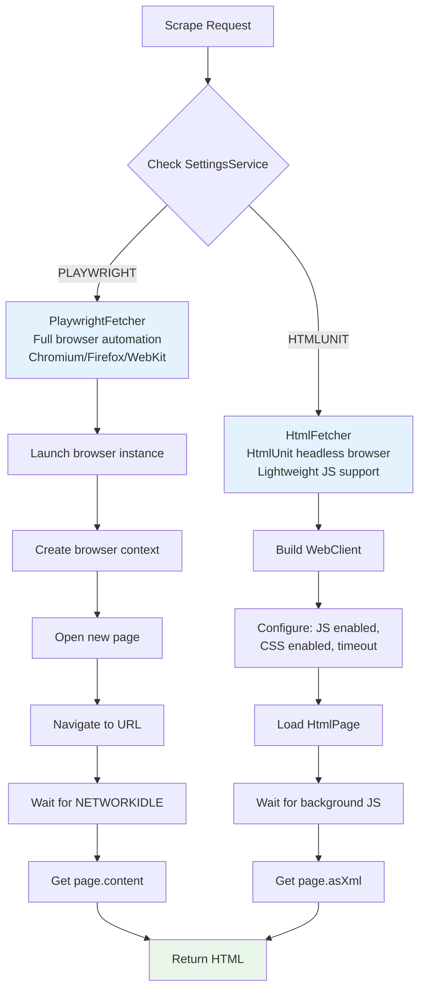
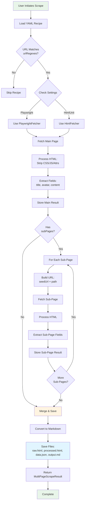
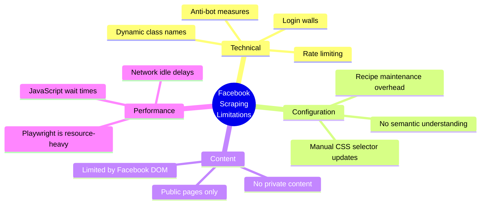

# Facebook Scraping: End-to-End Guide

This document provides a comprehensive overview of how the web scraper application handles Facebook page scraping, from configuration to data extraction.

## Overview

The scraper uses a **recipe-based, rule-driven approach** to extract structured data from Facebook public pages. It supports multi-page scraping, allowing you to scrape a main profile page and related sub-pages (About, Photos, etc.) in a single operation.



## Architecture Components



## Configuration: YAML Recipe

### Example Facebook Recipe

```yaml
# facebook-multipage-example.yaml
name: Facebook Public Page Multi-Page
description: Scrapes Facebook public pages including main page and about page

match:
  urlRegexes:
    - 'https://www.facebook.com/[A-Za-z0-9\.]+($|/.*)'

page:
  hrefSelector: "a[href*='facebook.com/']"
  
  # Main page fields
  fields:
    - name: title
      selectors: ["h1", "title"]
      source: TEXT
      
    - name: avatar
      selectors: ["svg[aria-label]:first-of-type g image"]
      source: ATTR
      attributeName: xlink:href
      
    - name: main_page_content
      selectors: ["[data-pagelet='ProfileTimeline']", ".userContentWrapper"]
      source: TEXT

  # Sub-pages with different field configurations
  subPages:
    - path: /about
      fields:
        - name: about_description
          selectors: ["[data-overviewsection='contact_basic_info']", ".about_section"]
          source: TEXT
          
        - name: contact_info
          selectors: ["[data-overviewsection='contact_basic_info'] .clearfix"]
          source: TEXT
          
        - name: website_url
          selectors: ["a[href^='http']"]
          source: ATTR
          attributeName: href
          
    - path: /photos
      fields:
        - name: photo_count
          selectors: [".photoCount", "[data-testid='photo_count']"]
          source: TEXT
          
        - name: recent_photos
          selectors: ["img[src*='scontent']"]
          source: ATTR
          attributeName: src
          multiple: true

options:
  stripCss: true
  stripJs: true
  removeAttributes: true
```

### Configuration Sections



## Execution Flow

### Multi-Page Scraping Sequence



### Field Extraction Detail



## Fetcher Selection



### Fetcher Comparison

| Feature | HtmlFetcher (HtmlUnit) | PlaywrightFetcher |
|---------|----------------------|-------------------|
| **Browser Engine** | HtmlUnit (legacy) | Chromium/Firefox/WebKit |
| **JavaScript** | Basic support | Full support |
| **Speed** | Faster | Slower (real browser) |
| **Accuracy** | May miss dynamic content | Renders like real user |
| **Resource Usage** | Low | High |
| **Recommended For** | Static/simple pages | Facebook, SPAs, dynamic content |

## HTML Processing Pipeline

```mermaid
flowchart LR
    RawHTML[Raw HTML] --> Parse[Jsoup.parse]
    Parse --> Document[HTML Document]
    
    Document --> StripCSS{stripCss?}
    StripCSS -->|Yes| RemoveStyle[Remove style, link<br/>rel=stylesheet]
    StripCSS -->|No| StripJS{stripJs?}
    RemoveStyle --> StripJS
    
    StripJS -->|Yes| RemoveScript[Remove script tags]
    StripJS -->|No| RemoveAttr{removeAttributes?}
    RemoveScript --> RemoveAttr
    
    RemoveAttr -->|Yes| FilterAttrs[Keep only:<br/>href, src, alt, title]
    RemoveAttr -->|No| ExtractHrefs
    
    FilterAttrs --> ExtractHrefs[Extract hrefs using<br/>hrefSelector]
    ExtractHrefs --> PrettyPrint[Disable pretty-print]
    PrettyPrint --> Output[Processed HTML]
    
    style RawHTML fill:#ffebee
    style Output fill:#e8f5e9
    style ExtractHrefs fill:#fff4e1
```



## Data Flow & Output

```mermaid
flowchart TB
    subgraph Input["Input"]
        SeedURL[Seed URL<br/>e.g., facebook.com/username]
        Recipe[YAML Recipe]
    end
    
    subgraph Process["Processing"]
        MainPage[Scrape Main Page]
        AboutPage[Scrape /about]
        PhotosPage[Scrape /photos]
        Merge[Merge All Results]
    end
    
    subgraph Output["Output Files"]
        RawDir[data/jobs/{jobId}/raw/]
        ProcDir[data/jobs/{jobId}/processed/]
        JsonDir[data/jobs/{jobId}/json/]
    end
    
    Input --> MainPage
    MainPage --> AboutPage
    MainPage --> PhotosPage
    AboutPage --> Merge
    PhotosPage --> Merge
    Merge --> RawDir
    Merge --> ProcDir
    Merge --> JsonDir
    
    RawDir --> RawFiles[raw-{timestamp}.html]
    ProcDir --> ProcFiles[processed-{timestamp}.html]
    JsonDir --> JsonFiles[{timestamp}.json]
    
    JsonFiles --> StructuredData["Structured JSON:<br/>{<br/>  title: '...',<br/>  avatar: '...',<br/>  about_description: '...',<br/>  contact_info: '...',<br/>  website_url: '...',<br/>  photo_count: '...',<br/>  recent_photos: [...],<br/>  url: '...',<br/>  timestamp: '...'<br/>}"]
    
    style Input fill:#e1f5ff
    style Process fill:#fff4e1
    style Output fill:#e8f5e9
    style StructuredData fill:#f3e5f5
```

## Complete End-to-End Flow



## Key Implementation Details

### 1. URL Matching

The scraper checks if a URL matches the recipe's `urlRegexes`:

```java
// MatchConfig.java
public class MatchConfig {
    private List<String> urlRegexes;
    
    public boolean matches(String url) {
        return urlRegexes.stream()
            .anyMatch(regex -> url.matches(regex));
    }
}
```

### 2. Multi-Page Execution

```java
// ScraperEngine.executeMultiPage()
public MultiPageScrapeResult executeMultiPage(RecipeConfig recipe,
                                              String seedUrl,
                                              OptionsConfig overrides,
                                              ProgressListener progressListener) {
    // 1. Scrape main page
    ScrapeExecutionResult mainResult = execute(recipe, seedUrl, overrides, listener);
    pageResults.put("main", new PageResult(seedUrl, ...));
    
    // 2. Scrape each sub-page
    for (SubPageConfig subPage : recipe.getPage().getSubPages()) {
        String subPageUrl = buildSubPageUrl(seedUrl, subPage.getPath());
        ScrapeExecutionResult subResult = scrapeSubPage(recipe, subPageUrl, subPage, ...);
        pageResults.put(pageKey, new PageResult(subPageUrl, ...));
    }
    
    // 3. Merge all results
    return new MultiPageScrapeResult(combinedData, pageResults, progress);
}
```

### 3. Field Extraction

```java
// FieldExtractionService.extractSingle()
private Object extractSingle(Document document, FieldConfig field) {
    for (String selector : field.getSelectors()) {
        Element element = document.select(selector).stream().findFirst().orElse(null);
        if (element != null) {
            String value = extractValue(element, field);
            if (value != null && !value.isBlank()) {
                return applyPattern(value, field.getDataPattern());
            }
        }
    }
    return null;
}
```

### 4. Sub-Page URL Construction

```java
// ScraperEngine.buildSubPageUrl()
private String buildSubPageUrl(String seedUrl, String path) {
    String cleanSeedUrl = seedUrl.endsWith("/") ? 
        seedUrl.substring(0, seedUrl.length() - 1) : seedUrl;
    String cleanPath = path.startsWith("/") ? path : "/" + path;
    return cleanSeedUrl + cleanPath;
}

// Example:
// seedUrl: "https://www.facebook.com/username"
// path: "/about"
// Result: "https://www.facebook.com/username/about"
```

## Output Structure

### JSON Output Example

```json
{
  "title": "Facebook Page Name",
  "avatar": "data:image/svg+xml;base64,...",
  "main_page_content": "User posts and timeline content...",
  "about_description": "Page description text...",
  "contact_info": "Contact information...",
  "website_url": "https://example.com",
  "photo_count": "1,234",
  "recent_photos": [
    "https://scontent.xx.fbcdn.net/v/photo1.jpg",
    "https://scontent.xx.fbcdn.net/v/photo2.jpg"
  ],
  "url": "https://www.facebook.com/username",
  "timestamp": "2026-03-04T10:30:00Z",
  "hrefs": [
    "https://www.facebook.com/username/about",
    "https://www.facebook.com/username/photos",
    "https://www.facebook.com/username/posts"
  ]
}
```

### File Storage Structure

```
data/
└── jobs/
    └── {jobId}/
        ├── raw/
        │   └── raw-{timestamp}.html
        ├── processed/
        │   └── processed-{timestamp}.html
        └── json/
            └── {timestamp}.json
```

## Limitations & Considerations



### Key Limitations

1. **No LLM/AI Intelligence**: Pure CSS selector-based extraction
2. **Manual Maintenance**: DOM changes require recipe updates
3. **Public Content Only**: Cannot scrape behind login walls
4. **Fragile Selectors**: Facebook's dynamic class names may break selectors
5. **Resource Intensive**: Playwright requires browser instances

## Best Practices

1. **Use Playwright for Facebook**: Better JavaScript rendering
2. **Test Selectors Regularly**: Facebook updates DOM frequently
3. **Use Data Attributes**: Prefer `[data-pagelet='...']` over class names
4. **Handle Errors Gracefully**: Sub-page failures don't stop main scrape
5. **Monitor Progress**: Use `ProgressListener` for long-running scrapes

## Related Files

| File | Purpose |
|------|---------|
| `facebook-multipage-example.yaml` | Example Facebook recipe |
| `ScraperEngine.java` | Core scraping orchestration |
| `FieldExtractionService.java` | CSS selector-based extraction |
| `HtmlProcessingService.java` | HTML cleaning & href extraction |
| `PlaywrightFetcher.java` | Full browser fetching |
| `HtmlFetcher.java` | Lightweight HtmlUnit fetching |
| `RecipeConfig.java` | Recipe configuration model |
| `PageConfig.java` | Page-level configuration |
| `SubPageConfig.java` | Sub-page configuration |
